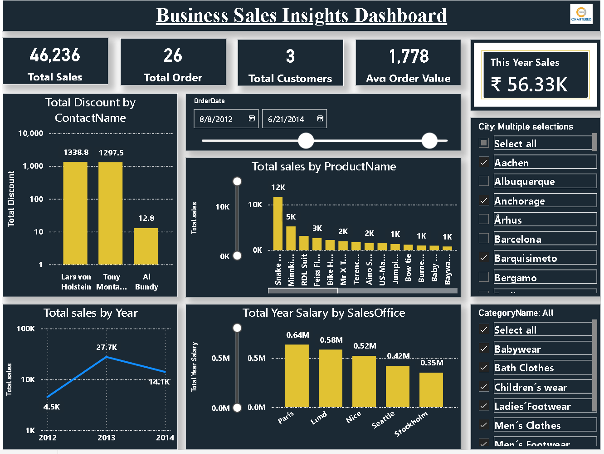
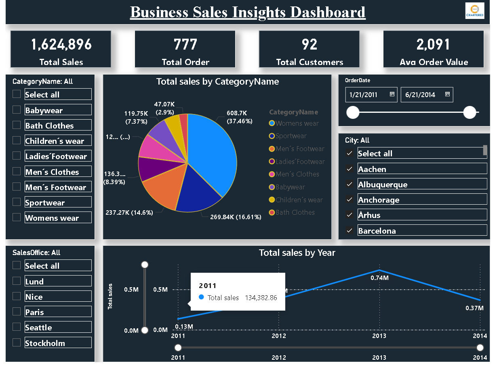

# 📊 Business Sales Insights Dashboard

## 📌 Project Overview

This project presents an interactive **Business Sales Insights Dashboard** developed using **Power BI**.
The dashboard helps analyze overall business performance including **sales revenue, customer activity, product performance, and regional sales trends**.

The goal of this project is to convert raw sales data into **meaningful insights** using data visualization and interactive filters.

---

## ❓ Business Questions

This dashboard helps answer the following business questions:

* What is the **total sales revenue**?
* How many **orders** were placed?
* How many **customers** contributed to sales?
* What is the **average order value**?
* Which **product categories** generate the most sales?
* Which **products** are the top sellers?
* Which **cities and sales offices** generate the highest revenue?
* How does **sales change over time**?

---

## 📈 Key Insights

From the analysis we can observe:

* The dashboard provides an overview of **total sales, orders, and customers**.
* **Category-wise sales analysis** helps identify high performing product segments.
* **Product-wise sales visualization** highlights top selling products.
* **Year-wise trend analysis** shows how sales change over time.
* **Sales office comparison** helps identify top performing regions.

These insights can help businesses **improve decision making and identify growth opportunities**.

---

## 📊 Dashboard Features

* KPI Cards (Total Sales, Orders, Customers, Average Order Value)
* Category-wise Sales Analysis
* Product-wise Sales Visualization
* Sales Trend by Year
* Sales Office Performance
* Customer Discount Analysis
* Interactive Filters (City, Category, Sales Office, Date)

---

## 🛠 Tools & Technologies Used

* Power BI
* Data Visualization
* DAX (Data Analysis Expressions)
* Data Cleaning & Transformation

---

## 📷 Dashboard Preview

---

## 📂 Project Files

* `Sales_Insights_Dashboard.pbix`
* `sales_data.xlsx`
* `dashboard.png`

---

## 👨‍💻 Author

**Motilal Jangid**
Data Analytics Enthusiast
